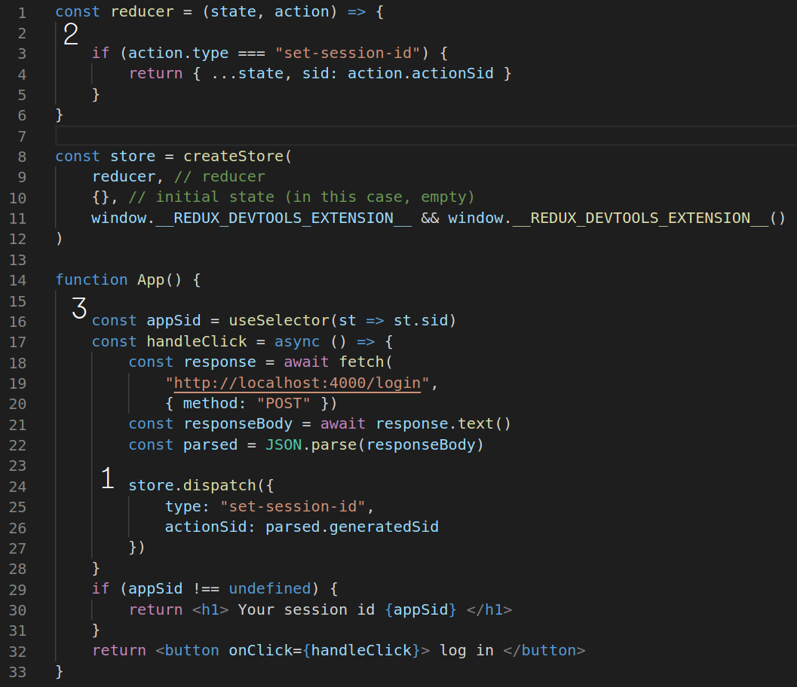
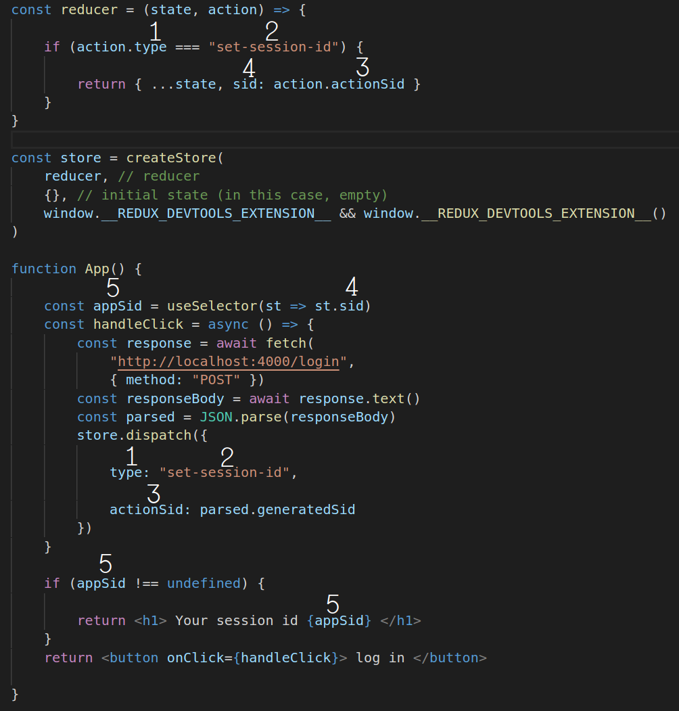

# Integrating redux into react

1. Install the `redux` and `react-redux` libraries
2. Import `createStore`, `Provider` and `connect`
3. Create a reducer
4. Create a store
5. Place the provider component
6. Connect your components

# Installation

Install the redux and react-redux libraries
`npm install redux`
`npm install react-redux`

Here are the most important values to be imported from the libraries:

```javascript
import { connect, Provider } from "react-redux"
import { createStore } from "redux"
```

# Reducer

- You can only have one reducer in your whole project
- It is simply a two parameter function defined by the programmer
- The first argument is the state
- The second argument is the action
- It returns a new state
- The first action passed always has type equal to `"@@INIT"`

### Example

```javascript
let reducer = (state, action) => {
  if (action.type === "addTodo") {
    return { todos: state.todos.concat(action.content) }
  }
  if(action.type === "@@INIT") return state // This action is generated by redux and is always the first action passed to your reducer
  throw new Error("Unrecognized action type " + action.type) // This is usually caused by a typo
}
```

# `createStore`

- This function is supplied by the redux library. It needs to be imported
- Only call this function once in your whole project
- It takes 3 arguments
- First argument: reducer (see above)
- Second argument: initial state
- Third argument (needed for redux devtools): `window.__REDUX_DEVTOOLS_EXTENSION__ && window.__REDUX_DEVTOOLS_EXTENSION__()`

### Example

```javascript
const store = createStore(
  reducer, // reducer
  {}, // initial state (in this case, empty)
  window.__REDUX_DEVTOOLS_EXTENSION__ && window.__REDUX_DEVTOOLS_EXTENSION__()
)
```

# `Provider`

- Component supplied by the react-redux library. It needs to be imported.
- Only used once in your whole project
- Must be an ancestor of all your connected components
- Takes one attribute called `store`, the value of that attribute is the store
- The easiest place to put it is as the top level component in the index.js file

### Example

```JSX
      ReactDOM.render(<Provider store={store}>
        <App/>
      </Provider>, document.getElementById("root"))

```

# `dispatch`

- The store has a property dispatch which refers to a function
- The function takes one argument
- The argument represents an action, it must have a property called type
- The reducer is then called with that action and the current state

### Example

```javascript
store.dispatch({
  type: "deletItem",
  itemNumber: 5
})
```

# Information flow

In the following diagram I put the flow of information. Each step is labeled. Step 1 happens first, then step 2, etc...


1. First dispatch is called. The argument of the dispatch is an object which describes how the store is to be modified. We call this object the action.
2. Because dispatch is called, the reducer is called and the second argument is the object that was dispatched in step 1. The first argument is the current state of the store. The reducer returns a new state. The redux library sets the state of the store to this new value.
3. The function passed to useSelector is called. If its return value, which is the sid property of the state of the store, has changed, the component is rerendered. The appSid variable will refer to this return value.

# Associations

In the following diagram I label each property name or string that must be equal.


1. Each action that is dispatched must have a type property. The reducer will then be able to look at the action type to determine how to handle the action.
2. The programmer has picked a unique string, `"set-session-id"` to identify this action. This is because there might be many different actions that are dispatched. In the reducer we can check that the type of an action matches this unique string.
3. The action can also contain other information. We can then use this information to modify the state in the reducer. The property name `actionSid` was picked by the programmer.
4. `sid` is a property name that was picked by the user to label the part of the state that is concerned with session ids.
5. `appSid` was picked by the programmer as the name of the variable used to access the `sid` property of the state.
